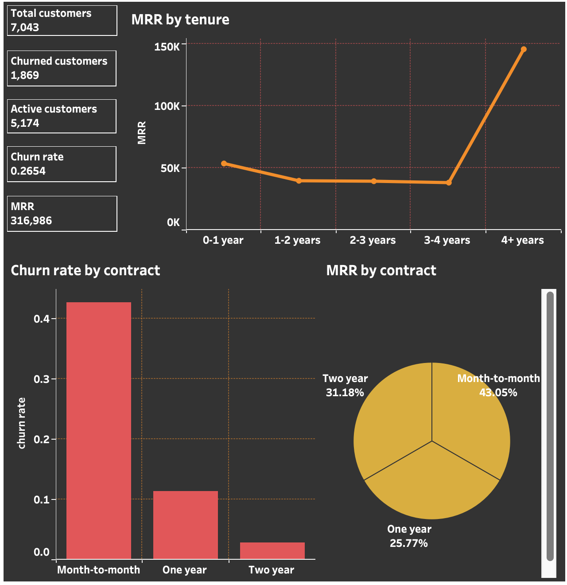
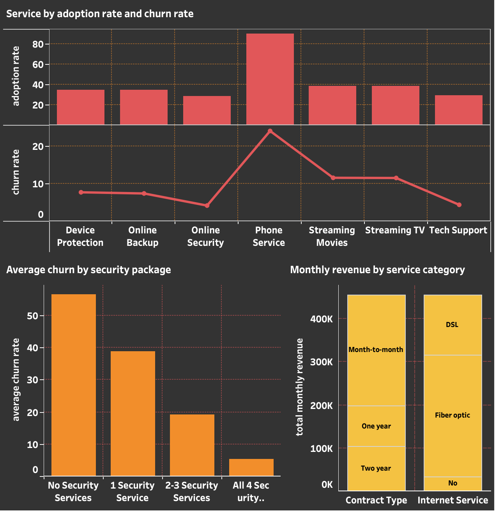
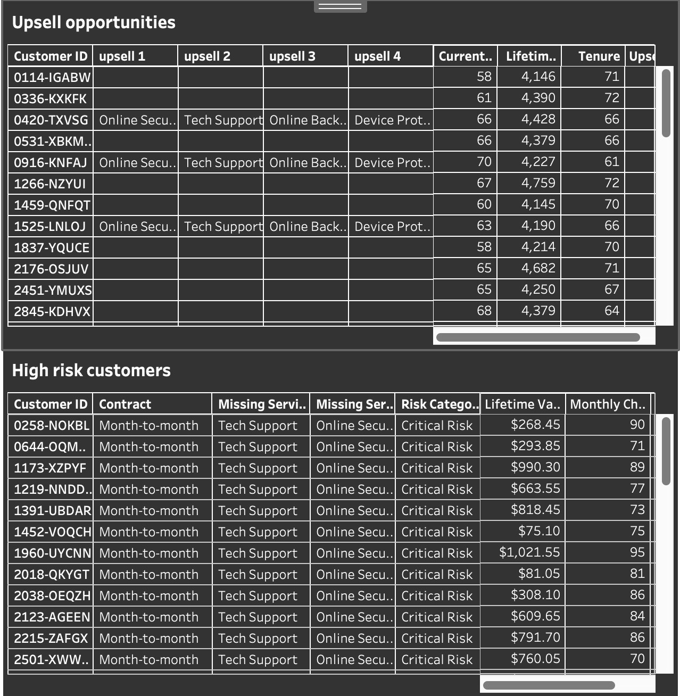

# 📊 Telco Customer Churn Analysis

**Tools:** MySQL | Tableau Public  
**Dataset:** IBM Telco Customer Churn Dataset (7,043 customers)

---

## 📌 Project Overview

This project analyzes customer churn for a fictional telecom company using SQL for data exploration and Tableau for interactive dashboards. The goal is to identify churn drivers, segment customers, and provide actionable retention recommendations.

---

## 🔍 Key Findings
- Overall churn rate is **26.5%** — roughly 1 in 4 customers leaves
- **Month-to-month** customers churn at 43% vs only 3% for two-year contracts
- **Electronic check** users have the highest churn rate (~45%)
- Customers with **all 4 security services** have only ~5% churn vs 56% with none
- **New customers (<6 months)** are the highest risk group at 54.7% churn
- **$1.67M** in annual revenue is at risk from churned customers

---

## 📈 Dashboards
### 1. Overview

### 2. Churn Analysis

### 3. Revenue Insights

### 4. Customer Segmentation

### 5. Service & Product Analysis

### 6. Recommendations

---

## 🗄️ SQL Analysis
- Data cleaning & validation
- Churn rate analysis by contract, tenure, payment method
- Revenue metrics & customer lifetime value
- Customer segmentation & risk scoring
- Service adoption & upsell opportunities

---

## 🔗 Interactive Dashboard
https://public.tableau.com/views/Telco_churn_analysis_17690951361390/Recommendations?:language=en-US&publish=yes&:sid=&:redirect=auth&:display_count=n&:origin=viz_share_link
